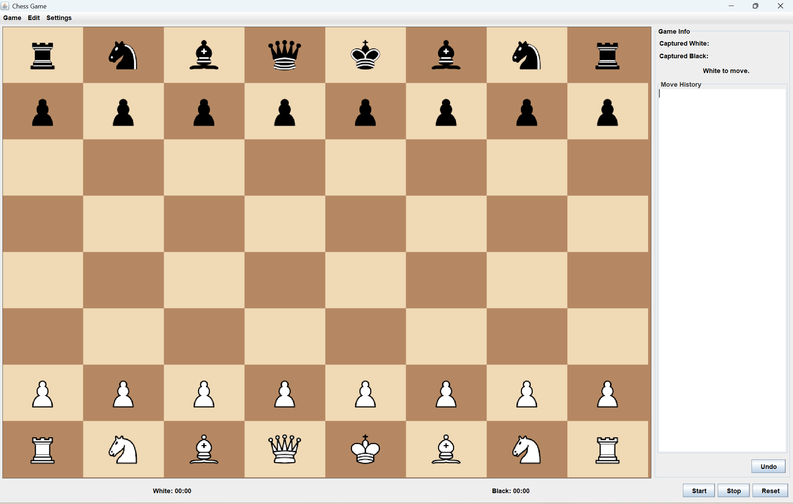
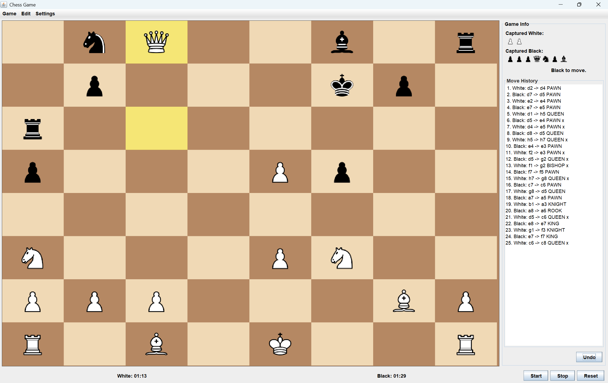
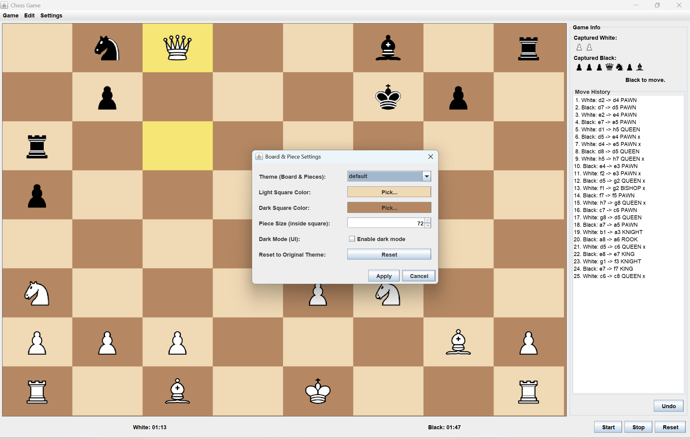
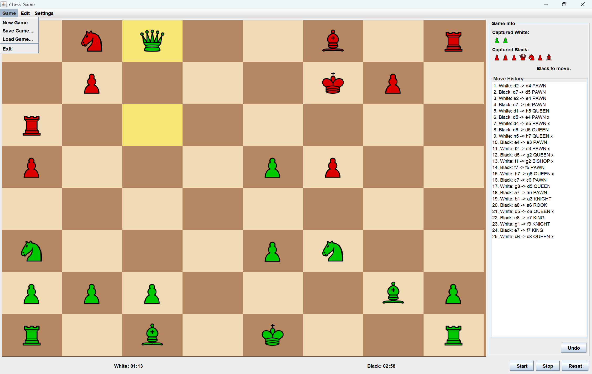
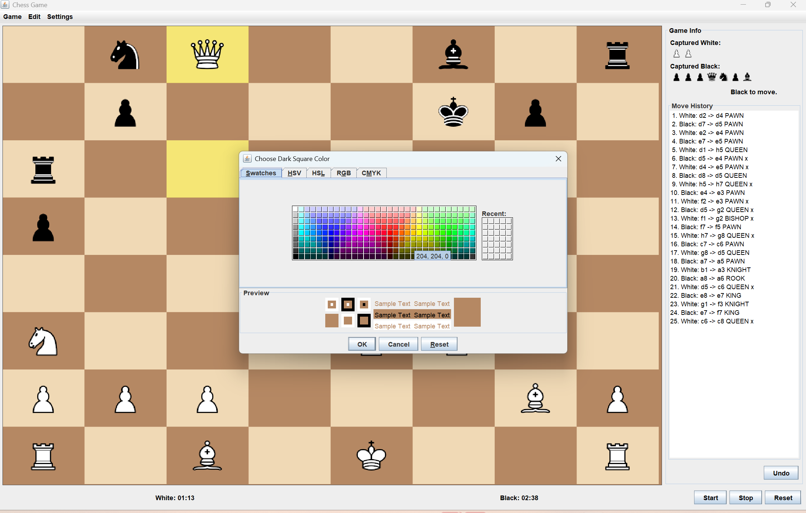

# **Dream Team — Chess Game GUI (CS 3354 – Phase 3)**  
### Fall 2025 — Final Project Submission

**Team Members:**  
- Theo Kliewer  
- Mario Mondragon  
- Ikram Yahya  

**Course:** CS 3354 — Object-Oriented Design  
**Project:** Chess Game — Phase 3

---

# **Project Overview**

This project implements a fully interactive **Chess Game GUI** using **Java** and **Swing**.  
Phase 3 delivers complete gameplay functionality, integrating both backend logic and front-end user interface.

This phase includes:

- Complete backend move logic  
- Capture rules  
- Check and checkmate detection  
- Interactive graphical board  
- Undo functionality  
- Move history display  
- Captured pieces panel  
- Player timers  
- Dark mode  
- Board color customization  
- Multiple piece themes  
- Save & Load  
- Settings window  
- UML class diagram  


---

# **Features Implemented**

## **1. Game Logic**
- Legal movement rules for all pieces  
- Move validation (prevents illegal moves)  
- Capture mechanics  
- Check and checkmate detection  
- Turn switching  
- Undo last move  

---

## **2. Graphical User Interface**
- Click-to-select piece, click-to-move  
- Highlighting of selected pieces and legal moves  
- Move history sidebar  
- Captured pieces display  
- Player timers (Start, Stop, Reset)  
- Menu bar with:
  - New Game  
  - Save  
  - Load  
  - Settings  
- Optional dark mode for interface

---

## **3. Customization Options**
- Light/dark board square color selection  
- Theme selection (Default, Vibrant, Ocean)  
- Adjustable piece size  
- Optional light or dark user interface theme  

---

# **How to Compile & Run the Chess Game**

## **Option 1 — Run Using IntelliJ IDEA (Recommended)**

1. Open **IntelliJ IDEA**  
2. Click **File → Open…**  
3. Select your project folder:  

   ```
   DreamTeam/
   ```

4. Let IntelliJ finish indexing  
5. Open the file:  

   ```
   src/chessgui/ChessApp.java
   ```

6. Click the **Run** button (green triangle) next to `main`  
7. The game will launch  

---

## **Option 2 — Run From Terminal (Windows)**

1. Open **Command Prompt**  
2. Go to your project directory:

   ```bat
   cd C:\Users\surfaceLaptop4\OneDrive\Desktop\DreamTeam
   ```

3. Compile all Java files:

   ```bat
   javac src\**\*.java -d out
   ```

4. Run the game:

   ```bat
   java -cp out chessgui.ChessApp
   ```

---

# **Screenshots**

### **1. New Game Screen**


### **2. Mid-Game Example**


### **3. Board & Piece Settings**


### **4. Theme Preview**


### **5. Dark Square Color Picker**


---

# **UML Class Diagram**

Includes:  
- Piece inheritance (Pawn, Rook, Knight, Bishop, Queen, King)  
- Board–Piece composition  
- GameState–Board relationship  
- GUI structure (ChessFrame → Panels)  
- Theme/Settings class interactions  

File located at:

```
uml/phase3_uml.png
```

---

# **Extra Credit Features Completed**

| Feature                      
|-------------------------------
| Dark mode                     
| Custom board colors          
| Multiple piece themes        
| Player timers                
| Move history               
| Captured pieces panel        
| Save & Load                
| Settings window               
| Undo move   
| AI Opponent
---

# **Project Structure**

```
src/
 ├─ chess/        (Backend logic)
 ├─ chessgui/     (GUI components)
 ├─ pieces/        (Piece images by theme)
 ├─ README.md/   (README plus the screenshots)
 └─ uml/           (UML diagrams)
```

---

# **Course Requirements Covered**

- Backend + GUI integration  
- Check + checkmate logic  
- Move history tracking  
- Captured pieces display  
- Customization features  
- Full UML diagram  
- Clean and organized repository  
- Detailed README  


---

# **Description of Extra Credit Features**

- AI Opponent: We added a basic computer-controlled opponent that plays as Black and automatically responds after each human move. The AI generates all legal moves available and selects one to play, allowing the user to play a full game against the computer. (ChessAppVsAI.java)
- Online Multiplayer Mode:

---

# **Final Notes**

This project provides a complete and fully functional **Java Swing Chess Game** with advanced gameplay logic and modern customization options.  

